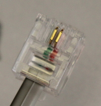
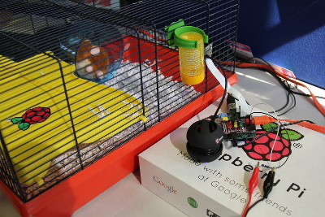
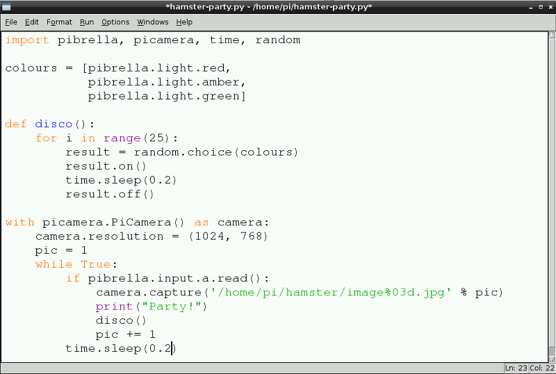

#Hamster Party Cam

> Hamsters are nocturnal, which means that they sleep in the day time and come out at night. This means that when you are sleeping, your hamsters are up and about and when you are up and about, your hamsters are sleeping!
>
> ~ Violet

We need to find some way of being able to see what the hamsters are up to during the night. I suspect they are partying.

In this project, we are going to use a Raspberry Pi camera and a Pibrella with a Raspberry Pi to take pictures and video of the hamsters, triggered by their movement.

##Step 0: Setting up your Raspberry Pi, Pi Camera and Pibrella

You will need to set up your Raspberry Pi to take part in this activity. See the [Raspberry Pi Start Guide](http://www.raspberrypi.org/help/quick-start-guide/) to get you up and running.

You will also require a Raspberry Pi camera module connected to your Raspberry Pi. See the [Raspberry Pi Camera Guide](http://www.raspberrypi.org/help/camera-module-setup/) to connect your camera to your Raspberry Pi. Then follow the [Raspberry Pi Camera Setup Tutorial](https://github.com/raspberrypilearning/python-picamera-setup) to enable the camera, test it, and download the `picamera` library.

Next, you will need a Pibrella board attached to the GPIO pins on your Raspberry Pi. See the [Pibrella](https://github.com/raspberrypilearning/pibrella-setup) guide to learn how to add the board and download the `pibrella` library.

Phew; that is a fair bit of setup, but it will be worth it in the end.

##Step 1: Create a trigger switch

We only want the Raspberry Pi to take pictures of the hamsters when they are out and having a good time. (No doubt they are throwing out some robot dance moves in your absence.) So you will need to create a trigger to make a program run, in order to take pictures of the party.

###Option 1:

1. Plug one end of a male to male jumper wire into the input socket labelled 'A' on your Pibrella.

	

2. Next, connect the other end of the jumper wire to a crocodile cable.

	

3. Connect the other end of the crocodile cable to the hamster cage.

	

4. When the hamster touches the clip, it will trigger the camera to take a photo, so make sure you put it somewhere in shot of the camera!

This is not the most effective trigger and may only work every now and then. A much more effective trigger lies in the use of the hamster wheel and a cheap [wind speed sensor](http://www.maplin.co.uk/p/maplin-replacement-wind-speed-sensor-for-n96fy-n82nf).

###Option 2:

1. If your hamster home includes a wheel then remove it from the cage and place it on a table, along side the wind speed sensor. You may need to locate an adult to help you unscrew the wind speed sensor case, and remove the [read switch](http://upload.wikimedia.org/wikipedia/commons/b/bd/Reed_switch_%28aka%29.jpg) and the magnet.

	

2. Then with some assitance strip the other end of the read switch of its RJ45 connector to expose the two wires inside. These will be used to connect the read switch to your pibrella.

	

3. Using sticky back plastic, stick the read switch to the centre of the hamster wheel and the magnet to the outer section of the wheel so that it rotates around and passes the read switch. The magnet will connect the wires inside the read switch to form a connection every time it comes in contact.
4. Next, connect the wires from the read switch to seperate crocodile clip cables.
5. Connect the other end of the crocodile cables to the end of two separate male to male jumper wires.
6. Finally, push the other end of the male to male jumper wires into the input sockets labelled 'A' on your Pibrella. It does not mater which way around as long as they are both connected to 'A'.

	

##Step 2: Create a Python program to take pictures of the hamsters

With a Pi camera connected and a pressure sensitive switch attached to the Pibrella board, you can now write a program in Python to detect movement and take a picture.

###Activity Checklist:

1. Open an LXTerminal window, type `mkdir hamster`, and press **enter** to create a folder for your hamster party pictures.
2. Then type `sudo idle &` and press **enter** to load the Python environment IDLE.
2. Click on **File** and **New Window** to open a new text editor file.
3. Save the file by clicking on **File** and **Save As**; name the file `hamster-party` and click **Ok**.
4. Now type the following code into your hamster file:

	```python
	import pibrella, picamera, time

	with picamera.Picamera() as camera:
    	camera.resolution = (1024, 768)
    	pic = 1
    	while True:
        	if pibrella.input.a.read():
            	camera.capture('/home/pi/hamster/image%03d.jpg' % pic)
            	print("Party!")
            	pic += 1
        	time.sleep(0.2)
	```
5. Save your work by clicking on **File** and **Save**.
6. To test that your program works, click on **File** and **Run Module**, then touch the tin foil a few times. To end the program press **CTRL** and **C** on the keyboard at the same time.
7. Look in the hamster folder or directory by navigating in the Main Menu to **Accessories** and **File Manager**, then double click the hamster folder icon. You should see some image files.

##Step 3: Get the party started with lights!

We can add extra fun to the Python program that uses more features of the Pibrella board. For example, why not trigger the lights to come on in disco mode when a hamster triggers the switch?

###Activity checklist:

1. Make sure that `hamster-party.py` is open in a text editor.
2. Add `random` to the end of `import pibrella, picamera, time` in the first line.
3. Underneath this, make a space to add a list for the LED lights on Pibrella like this:

	```python
	colours = [pibrella.light.red, pibrella.light.amber, pibrella.light.green]
	```
4. Below the list create a disco function by typing the following:

	```python
	def disco():
	    for i in range(25):
	        result = random.choice(colours)
	        result.on()
	        time.sleep(0.2)
	        result.off()
	 ```
5. Then navigate to the line `print("Party!")` and add `disco()` underneath the line.

	

6. Save and test your code. Your pressure sensitive switch should now trigger some disco lights on the Pibrella. The hamsters will love that!

##Step 4: Hamsters need music to dance!

Finally, let's trigger some tunes for the hamsters to dance to by downloading a sound file like an `.mp3` or `.wav` and playing it using omxplayer. You can use your own sound files if you transfer them to your Raspberry Pi; just change the name of the file in the code.

###Activity checklist:

1. First you will need to put a a sound file onto your Raspberry Pi. You could create one in Sonic Pi, or you could add a sound file by transferring a sound file from a computer with a USB memory stick.
2. Add `os, sys` to the end of the `import` line.
3. Now navigate to the line `print("party!")` and underneath add `os.system('omxplayer hamsterdance.mp3 &')`. *Note that you will need to replace the name of the mp3 with the name of the file you are using if it is different from the one being used here.*
3. Save the file and test that the program works by triggering the switch again.

##Final project code:

Your final project code should look something like this:

```python
import pibrella, picamera, time, random, os, sys

colours = [pibrella.light.red, pibrella.light.amber, pibrella.light.green]

def disco():
	for i  in range(10):
    	result = random.choice(colours)
    	result.on()
    	time.sleep(0.2)
    	result.off()

with picamera.PiCamera() as camera:
    camera.resolution = (1024, 768)
    pic = 1
    while True:
        if pibrella.input.a.read():
            camera.capture('/home/pi/hamster/image%03d.jpg' % pic)
            print("Party!")
            os.system('omxplayer hamsterdance.mp3 &')
            disco()
            time.sleep(10)
            pic += 1
        time.sleep(0.01)
```

Run your code and let your hamster loose. When the the program is triggered by the switch the lights will go into disco mode on the Pibrella, you should hear a tune and the camera will take a picture. After a while, check the images on your Raspberry Pi and you should see some photographs of your Hamsters having a good time.


